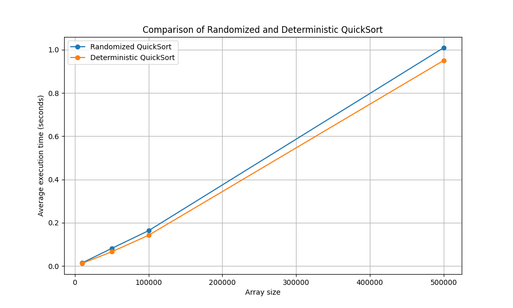

# Design and Analysis of Algorithms HW10 - Randomized and Deterministic algorithms

### Comparison of Randomized and Deterministic QuickSort

### Conclusion:
* Deterministic QuickSort with middle element selection as the reference showed slightly better performance.
* Randomized QuickSort guarantees to avoid the worst case O(n^2), but its average running time is slightly higher.
* For practical use, deterministic option with middle element selection is a good choice, but randomized approach is generally preferred for unpredictable cases.